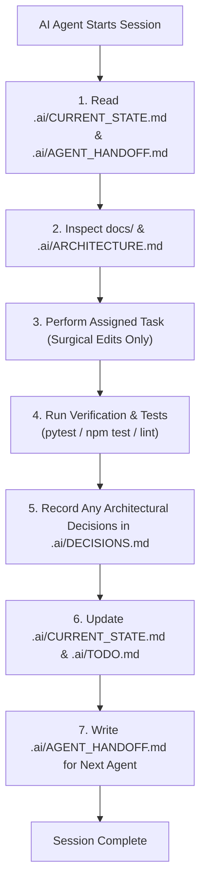

# 🤖 Multi-Agent AI Collaboration Workflow & Governance

> **Document:** `AI_AGENT_WORKFLOW.md`  
> **Status:** Approved Protocol  
> **Target Agents:** Codex, Claude Code, Gemini / Antigravity, DeepSeek

---

## 1. Multi-Agent Governance Framework

This repository can be maintained by human engineers and coding agents. The tracked `.ai/` files preserve reusable operational context; private profiles and vault paths stay outside the template.

To prevent context drift, file conflicts, architectural rot, and duplicate work, **every AI agent must strictly follow this protocol**.

---

## 2. Directory Responsibilities (`.ai/`)

The `.ai/` directory is the single source of operational memory for AI agents:

| File | Exact Responsibility | When to Update |
| :--- | :--- | :--- |
| **`PROJECT_CONTEXT.md`** | High-level repository identity, project goals, tech stack summary, and non-negotiable coding rules. | Rarely (only on major project scope change). |
| **`CURRENT_STATE.md`** | Real-time snapshot of the repository: what phase is active, what works, what is broken, and active environment status. | **Every session** upon completing work. |
| **`ARCHITECTURE.md`** | Concise technical reference summarizing folder conventions, API patterns, and database models for fast LLM retrieval. | When new core modules or schemas are introduced. |
| **`DECISIONS.md`** | Permanent Architectural Decision Records (ADRs) explaining *why* technical paths were chosen and alternatives rejected. | Whenever a major library, pattern, or strategy is selected. |
| **`TODO.md`** | Granular, checkable backlog of upcoming tasks organized by phase. | Whenever tasks are completed or new requirements discovered. |
| **`BUGS.md`** | Active and resolved bug registry including symptoms, root causes, and verified fixes. | When a bug is identified, investigated, or resolved. |
| **`AGENT_HANDOFF.md`** | Direct, unambiguous task handoff for the next AI agent or developer. | **At the end of every session**. |
| **`CHANGELOG_AI.md`** | Chronological audit log of AI sessions detailing date, agent role, modified files, and verification performed. | **At the end of every session**. |

---

## 3. Standard Operating Procedures for Agents

### Step 1: Pre-Execution Ingestion (Orientation)
Before touching any code, the agent **must read**:
1. `.ai/CURRENT_STATE.md` (What is the current build status?)
2. `.ai/AGENT_HANDOFF.md` (What specific task was assigned to me?)
3. Relevant architectural documentation in `docs/`.

### Step 2: Execution Guidelines (Surgical Changes)
- **Surgical Edits Only:** Never replace entire large files if modifying a single function or component will suffice.
- **Preserve Existing Comments:** Do not delete docstrings, license headers, or existing developer notes.
- **Strict Typing:** All Python code must include type hints (`Mapped[str]`, `str`, `dict[str, Any]`). All React code must be typed TypeScript (no raw `any`).
- **No Secret Commits:** Never hardcode API keys, passwords, or tokens. Read backend secrets from validated environment settings; never expose them through Vite's public build variables.
- **Windows UTF-8 Compliance:** Preserve UTF-8 encoding for Arabic text on every platform.

### Step 3: Verification & Test Execution
- Run tests on any code you modify before declaring the task complete:
  - Python: `pytest tests/api/test_xyz.py`
  - React: `npm run test` or `npm run build`
- If you introduce a new API route, you **must write an accompanying integration test**.

### Step 4: Session Closure & Handoff
Before ending your execution turn, you must:
1. Update `.ai/CURRENT_STATE.md` with current achievements.
2. Mark completed items in `.ai/TODO.md`.
3. Append a new entry to `.ai/CHANGELOG_AI.md`.
4. Update `.ai/AGENT_HANDOFF.md` with the current verified state and next step; retain important prior evidence where useful.

---

## 4. Forbidden AI Anti-Patterns

- ❌ **Do NOT install unapproved dependencies** without evaluating bundle size and security.
- ❌ **Do NOT bypass migrations:** Never tell the user to manually execute `CREATE TABLE` in production; always generate Alembic migrations.
- ❌ **Do NOT mix SSR logic into the frontend:** Frontend is a static React Vite SPA; do not add Node.js server dependencies to it.
- ❌ **Do NOT assume Linux paths on Windows:** Always format paths correctly for cross-platform execution or use Python's `pathlib.Path`.
