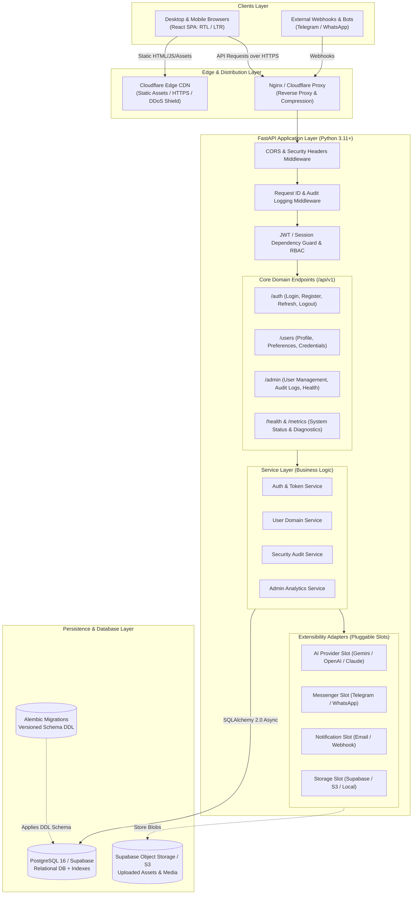
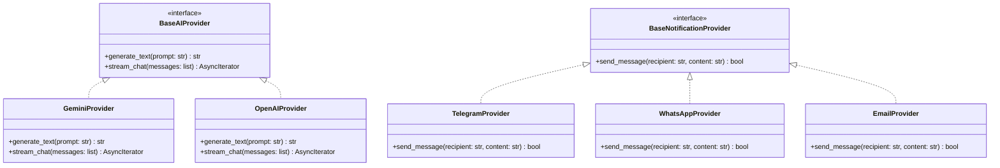

# 🏛️ System Architecture Specification

> **Document:** `ARCHITECTURE.md`  
> **Status:** Approved Baseline  
> **Platform:** Abdullah Developer Core (`abdullah-dev-core`)

---

## 1. High-Level System Architecture

The platform adopts a **decoupled, modular client-server architecture** with a clear separation of concerns between presentation, business rules, persistence, and external service adapters.



---

## 2. Layered Backend Architecture

The backend follows the **Ports & Adapters (Clean Architecture)** principles tailored for simplicity in Python:

```
backend/
├── app/
│   ├── api/             # HTTP Presentation Layer (Routers & Dependency Injection)
│   │   ├── deps.py      # Common FastAPI dependencies (get_db, get_current_user, require_role)
│   │   └── v1/          # Versioned endpoint definitions
│   ├── core/            # Infrastructure & Cross-Cutting Concerns
│   │   ├── config.py    # Pydantic BaseSettings (validated .env)
│   │   ├── security.py  # Password hashing (argon2/bcrypt), JWT encoding/decoding
│   │   ├── database.py  # SQLAlchemy async engine, sessionmaker, Base class
│   │   ├── logging.py   # Structured JSON logger & Loguru/structlog config
│   │   └── exceptions.py# Global domain exceptions and HTTP exception handlers
│   ├── models/          # SQLAlchemy ORM Database Entities
│   ├── schemas/         # Pydantic v2 Request/Response Data Validation Schemas
│   ├── services/        # Pure Business Logic (Independent of HTTP controllers)
│   └── integrations/    # Optional Pluggable Adapters (AI, Telegram, Email, S3)
```

### Flow of a Request:
1. **Network Ingress:** Request reaches Uvicorn ASGI server.
2. **Middleware Pipeline:**
   - Assigns a unique `X-Request-ID` UUID to the context.
   - Logs request timing, client IP, method, and route in structured JSON.
   - Checks CORS origin and applies security headers (HSTS, X-Content-Type-Options, Frame-Options).
3. **Routing & Validation:**
   - FastAPI parses the payload and query parameters against Pydantic schemas.
   - If invalid, immediately returns RFC-7807 compliant `422 Unprocessable Entity` with exact field errors.
4. **Dependency Resolution:**
   - Injects an async database session (`AsyncSession`).
   - Verifies the JWT Bearer or cookie, decodes user claims, and checks permissions (`require_role("admin")`).
5. **Service Invocation:**
   - The route handler invokes the appropriate `Service` method.
   - Routes never perform raw SQL queries or complex business calculations directly.
6. **Persistence & Response:**
   - Service commits or rolls back the transaction.
   - Response model transforms ORM entities into sanitized Pydantic JSON (stripping passwords, salt, internal tokens).

---

## 3. Layered Frontend Architecture

The frontend is an idiomatic React SPA structured by feature domains rather than arbitrary technical buckets:

```
frontend/
├── src/
│   ├── assets/          # Static brand images, SVGs, fonts
│   ├── components/      # Reusable Presentation Components
│   │   ├── ui/          # Primitives: Button, Input, Modal, Badge, Card, Table
│   │   ├── layout/      # Shell, Header, Sidebar, Footer, LanguageToggle
│   │   └── feedback/    # Toasts, AlertBanners, Skeletons, EmptyStates
│   ├── features/        # Domain Feature Modules
│   │   ├── auth/        # Login, Register, ForgotPassword, AuthGuard
│   │   ├── admin/       # DashboardStats, UserManagementTable, AuditLogs
│   │   └── profile/     # UserProfileSettings, SecuritySettings
│   ├── hooks/           # Custom React hooks (useDirection, useDebounce, etc.)
│   ├── lib/             # Third-party wrappers (axios client, queryClient, i18n setup)
│   ├── locales/         # Bilingual dictionaries
│   │   ├── ar/          # translation.json (Arabic)
│   │   └── en/          # translation.json (English)
│   ├── routes/          # React Router v6 tree with ProtectedRoute wrappers
│   ├── stores/          # Zustand client UI stores (themeStore, uiStore)
│   └── types/           # Shared TypeScript interfaces & API response contracts
```

---

## 4. Bilingual Directionality (RTL / LTR) Architecture

Supporting Arabic and English seamlessly requires strict bidirectional engineering:

1. **Document Level Switching:**
   - When the user switches language, the `useDirection` hook updates `document.documentElement.dir` (`rtl` or `ltr`) and `document.documentElement.lang` (`ar` or `en`).
   - The preference is persisted in `localStorage` and optionally synchronized with user database preferences.
2. **CSS Logical Properties in Tailwind:**
   - Standard directional classes (`ml-4`, `pr-2`) are avoided in favor of logical utilities (`ms-4`, `pe-2`).
   - Layout grids and flexboxes automatically invert when `dir="rtl"` is applied to the root container.
3. **Typography Pairing:**
   - **Arabic:** Cairo / IBM Plex Sans Arabic for crisp legibility and optical weight balance.
   - **English:** Inter / Outfit for modern, clean sans-serif balance.

---

## 5. Extensibility & Adapter Slots

To avoid bloat while ensuring rapid feature addition in future projects, the starter defines **abstract interface protocols** for optional services:



- Each adapter is instantiated via a factory function:
  `get_ai_provider()` or `get_notification_provider()`.
- If `AI_PROVIDER=disabled` in `.env`, the adapter returns a lightweight `NullAIProvider` that raises clear, informative logs without crashing the application.
- When a client project needs Telegram or Gemini, the developer simply sets `TELEGRAM_BOT_TOKEN=...` or `GEMINI_API_KEY=...` in `.env`, and the implementation is activated immediately.
