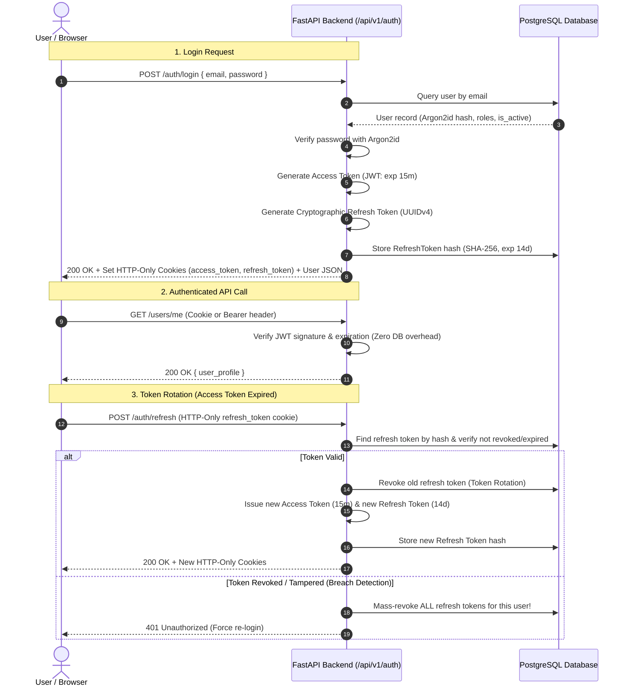

# 🔐 Authentication & Role-Based Authorization Strategy

> **Document:** `AUTH_STRATEGY.md`  
> **Status:** Approved Baseline  
> **Platform:** Abdullah Developer Core (`abdullah-dev-core`)

---

## 1. Authentication Architecture & Token Lifecycle

The core uses a modern, enterprise-hardened **JWT Dual-Token System** (Short-Lived Access Token + Rotating Refresh Token) engineered to prevent token theft and minimize database query overhead.



---

## 2. Token Security & Storage Rules

1. **HTTP-Only, Secure, SameSite Cookies:**
   - By default for web browsers, tokens are set in cookies with:
     - `HttpOnly = True`: JavaScript cannot read the token (eliminates XSS token theft).
     - `Secure = True`: Transmitted exclusively over HTTPS (disabled only on local `localhost`).
     - `SameSite = 'Lax'`: Protects against Cross-Site Request Forgery (CSRF).
2. **Dual-Mode Authorization (Header Fallback):**
   - For external mobile clients (e.g. Abdullah's React Native or Android apps) or CLI tools, the API also accepts standard `Authorization: Bearer <token>` headers.
3. **Password Hashing Standard:**
   - **Argon2id** (the OWASP gold standard, memory-hard, GPU-resistant).
   - Salt is cryptographically generated automatically per password.

---

## 3. Role-Based Access Control (RBAC) Hierarchy

The authorization model supports fine-grained hierarchical permissions:

| Role | Scope & Permissions | Example Endpoints Allowed |
| :--- | :--- | :--- |
| **`superadmin`** | Full system control, role modifications, tenant creation, database health. | `DELETE /api/v1/users/{id}`, `GET /api/v1/admin/audit-logs` |
| **`admin`** | User management, audit log viewing, content moderation. | `GET /api/v1/admin/users`, `PATCH /api/v1/admin/users/{id}/status` |
| **`manager`** | Operational administration for client businesses (e.g., store manager, instructor). | `GET /api/v1/reports`, `POST /api/v1/content` |
| **`user`** | Standard end-user. Access to own resources and public endpoints. | `GET /api/v1/users/me`, `PATCH /api/v1/users/me` |
| **`guest`** | Unauthenticated public visitor. | `POST /api/v1/auth/login`, `GET /api/v1/health` |

### FastAPI Dependency Guards (`app/api/deps.py`):
```python
# Route requiring any authenticated user
@router.get("/me")
async def get_me(current_user: User = Depends(get_current_active_user)):
    return current_user

# Route strictly requiring admin or superadmin
@router.get("/admin/users")
async def list_users(
    admin_user: User = Depends(require_role(["admin", "superadmin"])),
    db: AsyncSession = Depends(get_db)
):
    return await admin_service.get_users(db)
```

---

## 4. Frontend Route Guards & Role-Gated UI

1. **`AuthGuard` (`frontend/src/features/auth/AuthGuard.tsx`):**
   - Wraps authenticated routes (e.g., `/dashboard`, `/profile`).
   - If user is unauthenticated, redirects to `/login` preserving the `returnUrl`.
2. **`RoleGuard` (`frontend/src/features/admin/RoleGuard.tsx`):**
   - Inspects `user.roles`. If the user lacks the required role, renders an unauthorized screen (`403 Forbidden`) or redirects to `/dashboard`.
3. **Dynamic Navigation Filtering:**
   - The navigation sidebar dynamically hides administrative links (such as "إدارة المستخدمين" / "لوحة التحكم") from regular users to keep the interface uncluttered and clean.

---

## 5. Brute Force Defense & Rate Limiting

- **Endpoint Rate Limiting:**
  - `/api/v1/auth/login`: Maximum 5 attempts per 60 seconds per IP address (returns `429 Too Many Requests`).
  - `/api/v1/auth/register`: Maximum 3 registrations per hour per IP.
- **Audit Logging for Security Events:**
  - All failed login attempts, password changes, role elevations, and account suspensions trigger an entry in the `audit_logs` table recording the IP address, timestamp, and user agent.
