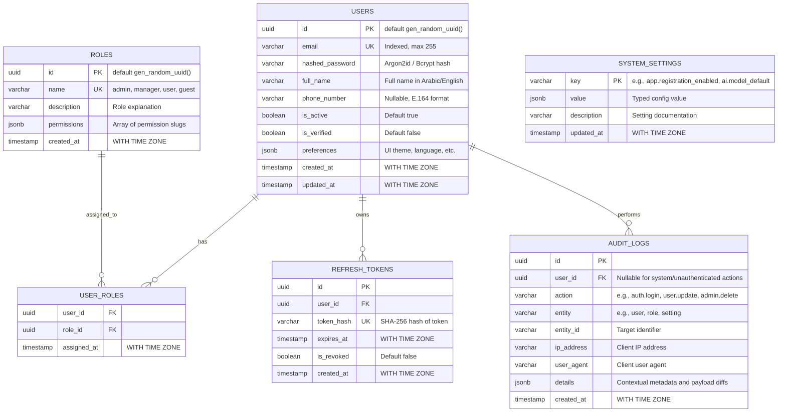

# 🗄️ Database Strategy & Schema Specification

> **Document:** `DATABASE_STRATEGY.md`  
> **Status:** Approved Baseline  
> **Platform:** Abdullah Developer Core (`abdullah-dev-core`)

---

## 1. Dual-Target Strategy: Local Docker & Supabase Cloud

To guarantee total developer freedom and zero vendor lock-in, the database layer adheres to standard **PostgreSQL 16** specifications:

1. **Local Development (Dockerized Postgres):**
   - Spins up instantly via `docker-compose.yml` (`postgres:16-alpine`).
   - PostgreSQL 16 provides `gen_random_uuid()` without an extension; the initial schema uses it for UUID defaults.
   - Completely offline-capable; perfect for developing on Abdullah's HP Omen laptop without active internet.
2. **Production / Staging (Supabase or Managed Postgres):**
   - Connects seamlessly via standard PostgreSQL connection URI.
   - Compatible with Supabase connection pooling (**Supavisor** on port `6543` for transaction mode) or direct connection (port `5432`).
   - Retains the flexibility to deploy to Railway Postgres, Neon, or self-hosted Ubuntu servers by updating `DATABASE_URL`.

---

## 2. Entity-Relationship Data Model (Core ERD)



---

## 3. Indexing & Optimization Strategy

1. **Unique & Lookup Indexes:**
   - `users(email)`: Unique B-tree index for instant O(1) login lookups.
   - `roles(name)`: Unique B-tree index (`admin`, `manager`, `user`).
   - `refresh_tokens(token_hash)`: Unique B-tree index for O(1) token verification and rotation.
2. **Foreign Key Indexes:**
   - `user_roles(user_id, role_id)`: Composite primary key ensuring no duplicate role assignments and fast join queries.
   - `refresh_tokens(user_id)`: Index for mass revocation on password reset or account deactivation.
   - `audit_logs(user_id, created_at)`: Composite index for fast timeline queries filtered by user.
3. **Audit Log Partitioning & Truncation:**
   - `audit_logs(created_at)`: Descending index for rapid admin audit log pagination.
   - Schema is designed so high-volume deployments can convert `audit_logs` into a PostgreSQL declarative range-partitioned table by month without modifying the application code.

---

## 4. Alembic Migration Protocol

All schema alterations are strictly managed through **Alembic**. Direct manual SQL alterations in production are forbidden.

### Workflow:
1. **Model Modification:** Update or add models in `backend/app/models/`.
2. **Generate Migration Script:**
   ```powershell
   # Windows PowerShell
   cd backend
   .venv/Scripts/python.exe -m alembic revision --autogenerate -m "describe_change"
   ```
3. **Inspect the Generated Revision:**
   - Every AI agent and developer **must inspect** the generated file in `backend/alembic/versions/` to verify:
     - No unintended drops or table renames occurred.
     - Constraints and nullable fields are set accurately.
     - Downgrade (`def downgrade()`) path is complete and reversible.
4. **Apply Migration:**
   ```powershell
   .venv/Scripts/python.exe -m alembic upgrade head
   ```

---

## 5. Automated Seeding & Superadmin Initialization

On fresh deployment or local spin-up, the system provides an idempotent seeding routine (`backend/app/core/seed.py`):
1. **Roles Seeding:** Inserts default roles if missing:
   - `superadmin`: Total platform control.
   - `admin`: Business administration and user management.
   - `user`: Standard authenticated end-user.
2. **Initial Admin Provisioning (Phase 3):**
   - Reads `INITIAL_ADMIN_EMAIL` and `INITIAL_ADMIN_PASSWORD` from `.env`.
   - Creates the superadmin user securely hashed with Argon2id if no admin currently exists.
   - Never overwrites or resets an existing administrator password upon subsequent restarts.

Phase 2 provides an explicit `python -m app.core.seed` command for the three baseline roles only. It does not create accounts or assign permissions. Phase 3 must implement the documented Argon2id bootstrap using `INITIAL_ADMIN_EMAIL` and `INITIAL_ADMIN_PASSWORD`, with no sample credentials accepted outside local development. Role seeding is idempotent and never changes an existing role's description or grants.

### Dedicated test database

`TEST_DATABASE_URL` must name a separate PostgreSQL database ending in `_test`; never reuse `DATABASE_URL`. The integration test fixture rejects an unsafe name or the developer database URL. The migration round-trip intentionally drops and recreates the Phase 2 schema within that dedicated database. Create the database itself once (for example, `abdullah_core_test`) before running pytest; all tables and indexes are created only by Alembic.

---

## 6. Connection Management & Pooling

- **SQLAlchemy Async Engine Configuration:**
  - `pool_size`: 10 (base persistent connections).
  - `max_overflow`: 20 (surge connections under high load).
  - `pool_timeout`: 30 seconds.
  - `pool_recycle`: 1800 seconds (prevents stale connection drops from firewalls and cloud proxies).
  - `pool_pre_ping`: True (executes a lightweight `SELECT 1` ping before handing a connection to a request, eliminating broken connection exceptions).
