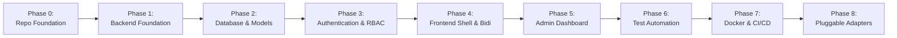

# 🗺️ Master Implementation Roadmap & Phase Plan

> **Document:** `DEVELOPMENT_ROADMAP.md`  
> **Status:** Approved Baseline  
> **Platform:** Abdullah Developer Core (`abdullah-dev-core`)

---

## 1. Overview & Phasing Strategy

The development of **Abdullah Developer Core** is structured into nine sequential, incremental, and strictly verifiable phases. Each phase is self-contained with explicit completion criteria and test gates to ensure high velocity without regressions.

---

## 2. Phase-by-Phase Execution Plan

### 🚀 Phase 0: Repository Foundation & Scaffolding
- **Objective:** Establish the foundational project repository, Git configuration, directory trees, Docker Compose orchestration for local database, environment templates, and documentation.
- **Files Affected:**
  - `.gitignore`, `.dockerignore`, `.env.example`
  - `docker-compose.yml`, `README.md`, `LICENSE`
  - `scripts/dev.ps1`, `scripts/dev.sh`
  - `.ai/*` (collaboration framework)
- **Implementation Tasks:**
  1. Initialize root `.gitignore` covering Python `.venv`, Node `node_modules`, `dist/`, `.env`, and IDE files.
  2. Create root `docker-compose.yml` defining `postgres:16-alpine` and persistent volume mounts.
  3. Create master `.env.example` with documented configuration defaults.
  4. Create developer convenience scripts for one-click startup on Windows (`dev.ps1`).
- **Completion Criteria:**
  - Running `docker compose up -d db` spins up a healthy PostgreSQL 16 database.
  - Environment templates and Git ignore rules prevent any credential leakage.
- **Tests Required:**
  - Validate Docker container startup and PostgreSQL connection via `pg_isready`.

---

### ⚙️ Phase 1: Backend Foundation & Core Infrastructure
- **Objective:** Build the FastAPI core application engine, configuration validation, structured logging, global exception handling, and health check endpoints.
- **Files Affected:**
  - `backend/pyproject.toml`, `backend/requirements.txt`
  - `backend/app/main.py`
  - `backend/app/core/config.py`, `backend/app/core/logging.py`, `backend/app/core/exceptions.py`
  - `backend/app/api/v1/health.py`, `backend/app/api/v1/router.py`
- **Implementation Tasks:**
  1. Set up Python virtual environment and dependencies (`fastapi`, `uvicorn`, `pydantic-settings`).
  2. Implement `Settings` class validating `.env` variables via Pydantic v2.
  3. Implement structured JSON logging middleware generating unique `X-Request-ID` headers.
  4. Implement global exception handlers transforming uncaught errors into RFC-7807 JSON.
  5. Mount `/api/v1/health` reporting application status, environment, and uptime.
- **Completion Criteria:**
  - Running `uvicorn app.main:app` boots cleanly without errors.
  - Hitting `GET http://localhost:8000/api/v1/health` returns `200 OK` with JSON payload.
  - Visiting `http://localhost:8000/docs` displays interactive Swagger UI.
- **Tests Required:**
  - Unit test for `Settings` validation.
  - Integration test for `GET /api/v1/health`.

---

### 🗄️ Phase 2: Database Layer & Declarative Models
- **Objective:** Establish the asynchronous SQLAlchemy 2.0 database engine, declarative ORM models, and the Alembic migration pipeline.
- **Files Affected:**
  - `backend/alembic.ini`, `backend/alembic/env.py`, `backend/alembic/versions/*`
  - `backend/app/core/database.py`
  - `backend/app/models/base.py`, `backend/app/models/user.py`, `backend/app/models/audit.py`, `backend/app/models/token.py`
- **Implementation Tasks:**
  1. Configure asynchronous SQLAlchemy engine and `async_sessionmaker` with connection pooling.
  2. Define `BaseModel` with UUID primary keys and timezone-aware timestamps.
  3. Define `User`, `Role`, `UserRole`, `RefreshToken`, and `AuditLog` ORM models.
  4. Initialize Alembic with async support in `backend/alembic/env.py`.
  5. Generate initial migration revision (`001_initial_schema.py`) and apply to PostgreSQL.
- **Completion Criteria:**
  - Alembic `upgrade head` successfully creates all tables and indexes in PostgreSQL.
  - Alembic `downgrade base` cleanly drops all tables without orphaned constraints, even after later revisions are added.
- **Tests Required:**
  - Migration round-trip integration test.
  - Database connectivity test verifying ping via async session.

---

### 🔐 Phase 3: Authentication & Role-Based Authorization (RBAC)
- **Objective:** Implement complete end-to-end user authentication, Argon2id password hashing, JWT access/refresh token rotation, and role-based authorization dependency guards.
- **Files Affected:**
  - `backend/app/core/security.py`
  - `backend/app/schemas/auth.py`, `backend/app/schemas/user.py`
  - `backend/app/services/auth_service.py`, `backend/app/services/user_service.py`
  - `backend/app/api/deps.py`, `backend/app/api/v1/auth.py`, `backend/app/api/v1/users.py`
- **Implementation Tasks:**
  1. Implement password hashing and verification using `argon2-cffi`.
  2. Implement JWT token encoder/decoder handling `sub`, `roles`, and expiration.
  3. Build `/auth/register`, `/auth/login`, `/auth/refresh`, and `/auth/logout` endpoints.
  4. Implement secure HTTP-only cookie setting and header-based Bearer fallback.
  5. Create FastAPI dependency guards: `get_current_user`, `get_current_active_user`, `require_role(roles)`.
  6. Implement `/users/me` endpoint for authenticated profile retrieval and updates.
- **Completion Criteria:**
  - A new user can register, receive sanitized user profile JSON, and login.
  - Login issues HTTP-only cookies and valid JWT.
  - Expired access tokens can be refreshed using valid refresh token.
  - Revoked refresh tokens are rejected and trigger mass revocation.
- **Tests Required:**
  - Unit tests for password hashing and JWT encoding/tampering.
  - Comprehensive API integration tests for full auth lifecycle.
  - Test verifying `require_role(["admin"])` rejects regular users with `403`.

---

### 🎨 Phase 4: Frontend Shell, Modern UI & Bilingual Engine (RTL / LTR)
- **Objective:** Scaffold the React (Vite) TypeScript application with Tailwind CSS, Lucide icons, full Arabic RTL and English LTR bidirectional switching, and base layout shell.
- **Files Affected:**
  - `frontend/package.json`, `frontend/vite.config.ts`, `frontend/tailwind.config.js`
  - `frontend/src/index.css`, `frontend/src/App.tsx`, `frontend/src/main.tsx`
  - `frontend/src/lib/i18n.ts`, `frontend/src/locales/ar/translation.json`, `frontend/src/locales/en/translation.json`
  - `frontend/src/hooks/useDirection.ts`, `frontend/src/stores/uiStore.ts`
  - `frontend/src/components/layout/AppShell.tsx`, `frontend/src/components/layout/Navbar.tsx`, `frontend/src/components/layout/Sidebar.tsx`
  - `frontend/src/pages/HomePage.tsx`, `frontend/src/pages/LoginPage.tsx`, `frontend/src/pages/RegisterPage.tsx`
- **Implementation Tasks:**
  1. Scaffold React + Vite + TypeScript project.
  2. Configure Tailwind CSS with RTL plugins, logical spacing, and Google Cairo + Inter fonts.
  3. Set up `i18next` with Arabic and English translation dictionaries.
  4. Implement `useDirection` hook dynamically switching `document.documentElement.dir` (`rtl` / `ltr`).
  5. Build responsive application shell (Header, Collapsible Sidebar, Language Switcher, Theme Switcher).
  6. Build pixel-perfect, responsive Login and Register pages supporting instant language toggling.
- **Completion Criteria:**
  - Clicking language switch toggles entire UI layout between Arabic RTL and English LTR without page reload.
  - Login and Register forms render cleanly on desktop and mobile viewports.
- **Tests Required:**
  - Vitest component tests verifying `dir` attribute updates on language change.
  - Form validation tests for email and password fields.

---

### 🛡️ Phase 5: Admin Dashboard & User Management
- **Objective:** Create the role-gated administrative suite featuring KPI metrics, interactive user management table (status toggle, role assignment), and audit log inspection.
- **Files Affected:**
  - `backend/app/api/v1/admin.py`, `backend/app/services/admin_service.py`, `backend/app/schemas/admin.py`
  - `frontend/src/features/admin/AdminPage.tsx`, `frontend/src/features/admin/RoleGuard.tsx`
  - `frontend/src/features/admin/components/UserTable.tsx`, `frontend/src/features/admin/components/AuditLogViewer.tsx`
- **Implementation Tasks:**
  1. Build backend endpoints:
     - `GET /api/v1/admin/users`: Paginated user list with search and role filtering.
     - `PATCH /api/v1/admin/users/{id}`: Update user role, active status, or verification.
     - `GET /api/v1/admin/audit-logs`: System audit trail.
     - `GET /api/v1/admin/stats`: User counts, active sessions, system health.
  2. Implement frontend `RoleGuard` restricting `/admin` strictly to `admin` / `superadmin`.
  3. Build responsive data table with status badges, role dropdowns, and search debouncing.
  4. Build audit log viewer displaying timestamp, actor, action, and JSON details modal.
- **Completion Criteria:**
  - Regular users navigating to `/admin` are blocked with clean unauthorized feedback.
  - Administrators can change a user's role or suspend an account in real time.
  - System logs every administrative action into `audit_logs`.
- **Tests Required:**
  - Backend integration tests for admin endpoints with role enforcement.
  - Frontend test verifying `RoleGuard` blocks unauthorized access.

---

### 🧪 Phase 6: Comprehensive Automated Test Suite
- **Objective:** Consolidate all unit, integration, and contract tests across backend and frontend, achieving over 85% test coverage on critical paths.
- **Files Affected:**
  - `backend/tests/conftest.py`, `backend/tests/api/*`, `backend/tests/unit/*`
  - `frontend/src/**/*.test.tsx`
- **Implementation Tasks:**
  1. Ensure complete test coverage of auth lifecycle (register -> login -> refresh -> logout -> revoked token).
  2. Add tests for edge cases: SQL injection attempts, malformed JWTs, expired cookies, brute-force rate limits.
  3. Add frontend tests for `AuthGuard`, `RoleGuard`, and bilingual rendering.
- **Completion Criteria:**
  - `pytest --cov=app` passes with 0 failures and >85% coverage on `core`, `services`, and `api`.
  - `npm run test` passes with 0 failures.
- **Tests Required:**
  - Execute full test suites locally.

---

### 🚢 Phase 7: Production Containerization & CI/CD Pipelines
- **Objective:** Finalize production multi-stage Dockerfiles, GitHub Actions workflows, and deployment blueprints for Railway, Cloudflare Pages, and Supabase.
- **Files Affected:**
  - `backend/Dockerfile`, `frontend/Dockerfile`
  - `.github/workflows/backend-ci.yml`, `.github/workflows/frontend-ci.yml`
  - `docker-compose.prod.yml`, `scripts/build.ps1`
- **Implementation Tasks:**
  1. Create multi-stage, non-root `backend/Dockerfile` with production Gunicorn/Uvicorn workers.
  2. Create production `frontend/Dockerfile` with Nginx Alpine and caching headers.
  3. Configure GitHub Actions workflows to run linters, type checks, and test suites on push.
  4. Document one-click deployment procedures for Railway and Cloudflare Pages.
- **Completion Criteria:**
  - `docker compose -f docker-compose.prod.yml up` builds and runs the entire stack in production mode.
  - GitHub Actions runs pass green on push.
- **Tests Required:**
  - Build and run production containers locally; verify `/api/v1/health` responds healthy.

---

### 🔌 Phase 8: Reusable Extension Slots (Pluggable Modules)
- **Objective:** Implement modular adapter interfaces for optional third-party integrations (AI models, Telegram/WhatsApp bots, Cloud Storage, Transactional Email).
- **Files Affected:**
  - `backend/app/integrations/base.py`
  - `backend/app/integrations/ai/gemini.py`, `backend/app/integrations/ai/openai.py`
  - `backend/app/integrations/messenger/telegram.py`, `backend/app/integrations/messenger/whatsapp.py`
  - `backend/app/integrations/storage/supabase_storage.py`
  - `backend/app/integrations/notifications/email.py`
- **Implementation Tasks:**
  1. Define abstract protocols for `BaseAIProvider`, `BaseMessenger`, `BaseStorage`, and `BaseEmailNotifier`.
  2. Implement reference adapter for **Gemini AI** (`google-generativeai`).
  3. Implement reference webhook listener for **Telegram Bot API**.
  4. Implement reference S3/Supabase Storage client for user avatar and file uploads.
  5. Provide `NullProvider` fallback for all slots so core runs flawlessly without keys.
- **Completion Criteria:**
  - Setting `AI_PROVIDER=gemini` and providing an API key enables AI endpoints.
  - Disabling integrations leaves zero runtime errors or performance penalties.
- **Tests Required:**
  - Unit tests for adapter factory methods and null provider fallbacks.
