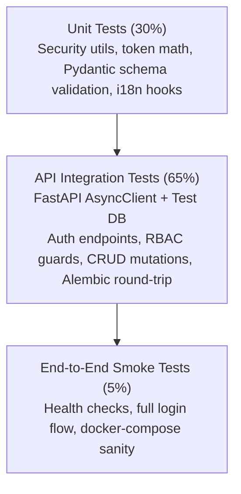

# 🧪 Testing Strategy & Quality Assurance

> **Document:** `TESTING_STRATEGY.md`  
> **Status:** Approved Baseline  
> **Platform:** Abdullah Developer Core (`abdullah-dev-core`)

---

## 1. Testing Philosophy & Test Pyramid

Testing in **Abdullah Developer Core** focuses on high confidence, fast feedback loops, and zero flaky test overhead. We emphasize **integration tests of API contracts and authentication logic** over mocking every minor helper function.



---

## 2. Backend Testing Toolchain (Pytest + AsyncClient)

### Core Libraries:
- **`pytest`**: Test discovery and execution engine.
- **`pytest-asyncio`**: Seamless testing of async FastAPI endpoints and async database transactions.
- **`httpx`**: Asynchronous HTTP test client (`httpx.AsyncClient`) passing requests directly into FastAPI ASGI without network overhead.
- **`pytest-cov`**: Test coverage reporting.

### Test Isolation Strategy

1. **Markers by folder** (`tests/conftest.py`): `tests/unit` and `tests/api` are `unit` and need no database; `tests/integration` is `integration` and needs PostgreSQL. `pytest -m unit` is the fast loop; plain `pytest` runs everything.
2. **Dedicated test database:** `TEST_DATABASE_URL` must use asyncpg, name a database ending in `_test`, and not resolve to the same host, port and database as `DATABASE_URL` (`tests/db_guard.py`, unit-tested). The development database is never touched.
3. **Rollback per test:** request-level integration tests bind the app to one outer transaction (`join_transaction_mode="create_savepoint"`) that is rolled back afterwards.
4. **Real concurrency only where it is the property:** refresh rotation, bootstrap and superadmin demotion races use independent committed connections, prove the second transaction was blocked (`pg_stat_activity` lock wait), and delete their rows in `finally`.
5. **Fixtures:** each integration module defines a small app/client fixture plus user helpers (`add_user`/`make_user`, `login`/`bearer`); there is no global seeded-user fixture.

---

## 3. Critical Test Suites Matrix

| Category | Test Path | Primary Invariants Verified |
| :--- | :--- | :--- |
| **Security & Crypto** | `tests/unit/test_security.py` | Argon2id hash/verify and worker offload; JWT `alg:none`, HS512, wrong key, each missing claim, non-UUID `sub`, future `iat`, expiry and wrong type are rejected; extra `roles` claims are ignored. |
| **Authentication Flow** | `tests/integration/test_auth.py`, `test_auth_regressions.py` | Register/login/profile/logout; refresh rotation, known-reuse revocation, unknown/expired tokens; deleted or disabled users; cookie `Path`/`Max-Age`/`Secure`/host-only on login and logout; rollback after the conditional refresh UPDATE; a proven-concurrent refresh race; bootstrap lock race and no promotion of existing accounts; secrets absent from logs on reuse and bootstrap; route inventory (every non-public route needs an active user); name spoofing characters rejected. |
| **RBAC & Administration** | `tests/integration/test_admin.py` | 401/403/200 per role for every admin route (inventory-checked); pagination, escaped search, role filter; admin vs superadmin limits; no self-modification; immediate role and status effect; disabled admins lose access; last-superadmin invariant incl. concurrent demotion and rollback; audit rows; no secrets in admin responses. |
| **HTTP Boundary** | `tests/api/*` | CORS allowlist and preflight, no grant for other origins, security headers, HSTS only in production, docs-only CSP relaxation, RFC 7807 errors, sanitized 500s and database-error logging, readiness. |
| **Database** | `tests/integration/test_database.py` + `get_db` test | Migration base→head→base→head and drift check, constraints, cascades, restricted role deletion, `get_db` rollback and connection release when a handler raises. |
| **Frontend** | `frontend/src/test/*` | EN/LTR and AR/RTL (including pre-paint direction), persistence, forms, AuthGuard/RoleGuard, login destination allowlist, refresh coordination and Web Lock ordering, cross-tab sign-out, logout success/failure, admin actions and confirmations, dialog focus, loading/error/empty states, inert audit rendering. |

---

## 4. Frontend Testing Toolchain (Vitest + React Testing Library)

### Core Libraries:
- **`vitest`**: Vite-native test runner with Jest-compatible API.
- **`@testing-library/react`**: Component testing from the user's perspective (accessibility, button clicks, text presence).
- **`@testing-library/user-event`**: Realistic user event simulations.

### Key Frontend Invariants:
1. **Bilingual Directionality:**
   - Verify switching to Arabic toggles root `dir="rtl"` and renders Arabic labels.
   - Verify switching to English toggles root `dir="ltr"` and renders English labels.
2. **Route Protection:**
   - `AuthGuard` renders login redirect when no authenticated session exists.
   - `RoleGuard` renders `403 Access Denied` when an authenticated non-admin attempts to access `/admin`.
3. **Form Validation:**
   - Login form disables submit button when email format is invalid.

---

## 5. Execution Commands

```powershell
# Backend (from backend/)
.venv/Scripts/python.exe -m pytest -q              # everything (needs the *_test database)
.venv/Scripts/python.exe -m pytest -m unit -q      # fast, no database
.venv/Scripts/python.exe -m pytest --cov           # with coverage report

# Frontend (from frontend/)
npm run test
npm run test:coverage                              # text summary + coverage/index.html
```

Coverage is reported, not enforced. Backend coverage traces greenlets (`concurrency = ["greenlet", "thread"]`) because SQLAlchemy async code runs inside them; without it, executed lines appear missed. Use the report to find untested behavior; do not add tests only to raise the number.
