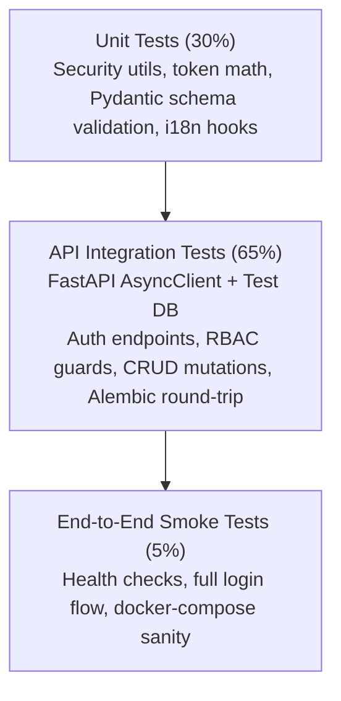

# 🧪 Testing Strategy & Quality Assurance

> **Document:** `TESTING_STRATEGY.md`  
> **Status:** Approved Baseline  
> **Platform:** Abdullah Developer Core (`abdullah-dev-core`)

---

## 1. Testing Philosophy & Test Pyramid

Testing in **Abdullah Developer Core** focuses on high confidence, fast feedback loops, and zero flaky test overhead. We emphasize **integration tests of API contracts and authentication logic** over mocking every minor helper function.



---

## 2. Backend Testing Toolchain (Pytest + AsyncClient)

### Core Libraries:
- **`pytest`**: Test discovery and execution engine.
- **`pytest-asyncio`**: Seamless testing of async FastAPI endpoints and async database transactions.
- **`httpx`**: Asynchronous HTTP test client (`httpx.AsyncClient`) passing requests directly into FastAPI ASGI without network overhead.
- **`pytest-cov`**: Test coverage reporting.

### Test Isolation Strategy (`tests/conftest.py`):
1. **Isolated Test Database:** Tests run against a dedicated PostgreSQL database container (`test_db`) or an asynchronous SQLite in-memory instance (`sqlite+aiosqlite:///:memory:`).
2. **Transaction Rollback per Test:** Each test executes within an isolated database transaction that rolls back automatically upon completion, ensuring pristine database state for subsequent tests.
3. **Pre-Built Fixtures:**
   - `client`: Unauthenticated `AsyncClient`.
   - `db_session`: Clean async database session.
   - `test_user`: Seeded standard user (`user` role).
   - `test_admin`: Seeded administrator user (`admin` role).
   - `auth_headers`: Pre-authenticated headers with valid JWT bearer token.

---

## 3. Critical Test Suites Matrix

| Category | Test Path | Primary Invariants Verified |
| :--- | :--- | :--- |
| **Security & Crypto** | `tests/unit/test_security.py` | - Argon2id hashing and verification work reliably.<br>- Password hash changes upon password update.<br>- JWT creation embeds expiration and subject.<br>- Expired or tampered JWT fails decoding. |
| **Authentication Flow** | `tests/api/test_auth.py` | - Successful registration creates user and sends clean JSON (no password).<br>- Login with correct credentials returns 200 and sets cookies.<br>- Login with invalid password returns 401.<br>- Refresh endpoint rotates token and invalidates old token.<br>- Tampered refresh token revokes all user sessions. |
| **RBAC Authorization** | `tests/api/test_admin.py` | - Standard user hitting `/api/v1/admin/users` gets `403 Forbidden`.<br>- Unauthenticated user hitting protected routes gets `401 Unauthorized`.<br>- Admin hitting `/api/v1/admin/users` receives paginated user list. |
| **Database Migrations** | `tests/integration/test_migrations.py` | - Alembic `upgrade head` executes cleanly.<br>- Alembic `downgrade -1` executes reversibly without data corruption. |

---

## 4. Frontend Testing Toolchain (Vitest + React Testing Library)

### Core Libraries:
- **`vitest`**: Vite-native test runner with Jest-compatible API.
- **`@testing-library/react`**: Component testing from the user's perspective (accessibility, button clicks, text presence).
- **`@testing-library/user-event`**: Realistic user event simulations.

### Key Frontend Invariants:
1. **Bilingual Directionality:**
   - Verify switching to Arabic toggles root `dir="rtl"` and renders Arabic labels.
   - Verify switching to English toggles root `dir="ltr"` and renders English labels.
2. **Route Protection:**
   - `AuthGuard` renders login redirect when no authenticated session exists.
   - `RoleGuard` renders `403 Access Denied` when an authenticated non-admin attempts to access `/admin`.
3. **Form Validation:**
   - Login form disables submit button when email format is invalid.

---

## 5. Execution Commands

```powershell
# Run Backend Tests (from /backend directory)
pytest -v --cov=app --cov-report=term-missing

# Run Specific Auth Test Suite
pytest tests/api/test_auth.py -v

# Run Frontend Tests (from /frontend directory)
npm run test

# Run End-to-End Stack Validation
docker compose up -d --build
curl http://localhost:8000/api/v1/health
```
